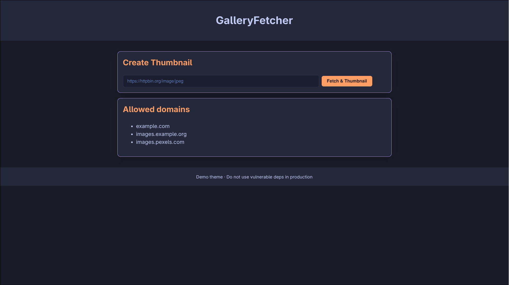

# GalleryFetcher

GalleryFetcher is a simple Django-based demo application that fetches remote images, generates thumbnails, and applies a watermark.  
It was intentionally built with dependencies that include known security vulnerabilities so that tools like **`pip-audit`** can be demonstrated in action.

---

## Example Screenshot



---

## Features

- Submit an image URL (restricted by allowed domains in `config.yaml`).
- Downloads the image using `urllib3`.
- Generates a thumbnail and watermark using `Pillow`.
- Configurable list of allowed domains via YAML (`PyYAML`).
- Runs on a minimal Django project with one app (`gallery`).

---

## Security Importance

This project is not meant for production. It is a learning tool for understanding why keeping dependencies updated is critical.

- Outdated Django versions may contain request/response handling vulnerabilities.
- PyYAML <5.1 can execute arbitrary code if `yaml.load()` is misused.
- Old Pillow releases can include remote code execution flaws in image parsing.
- urllib3 has had multiple issues around leaking cookies or unsafe redirects.

Leaving these vulnerabilities unpatched can allow attackers to:
- Steal or manipulate sensitive data.
- Execute arbitrary code on the server.
- Bypass authentication or authorization checks.
- Escalate privileges in your environment.

---

## Mitigation Steps

When auditing with `pip-audit`, you will see these flagged vulnerabilities. To mitigate:

- Upgrade Django to the latest LTS or security release.
- Upgrade PyYAML (>=5.4) and use `safe_load` for untrusted data.
- Upgrade Pillow (>=10.2.0).
- Upgrade urllib3 (>=1.26.19 or 2.x).

After upgrading, always re-run:
```bash
pip-audit -r requirements.txt
```

to confirm that no known vulnerabilities remain.

---

## Running the App

```bash
# create venv
python -m venv .venv
source .venv/bin/activate

# install dependencies
pip install -r requirements.txt

# run server
python manage.py runserver
```

Then open `http://127.0.0.1:8000/` in your browser.

---

## Purpose

This application demonstrates how outdated dependencies can affect the security of a web project.
It is a hands-on way to practice dependency auditing and see first-hand why secure software supply chains matter.

